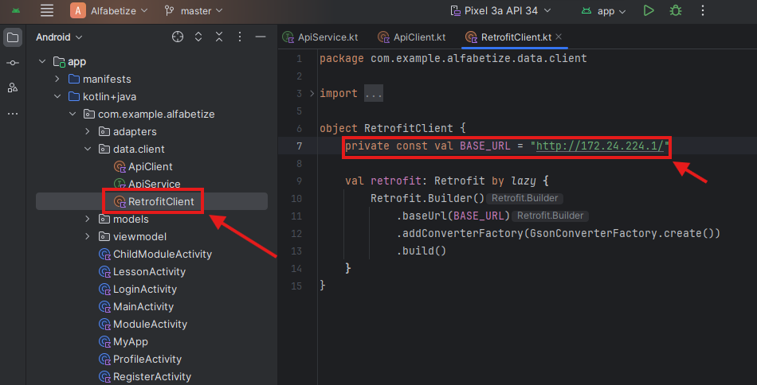
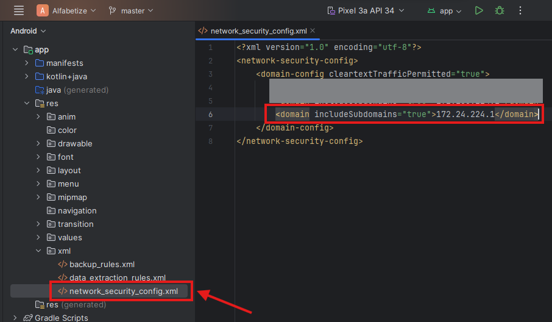

# Alfabetize

Alfabetize é uma plataforma SaaS, que permite instituições de ensino transformar seus conteúdos em uma experiência gamificada.

## Começando

Estas instruções permitirão que você obtenha uma cópia do projeto em funcionamento na sua máquina local para fins de desenvolvimento e teste.

### Pré-requisitos

Para a instalação e execução da aplicação você precisa de:

- Git
- PHP 8.2 - 8.3
- Composer 2.7.x
- Linux ou WSL
- Docker
- JDK 17 ou maior
- Android Studio

## Instalação

A seguir o passo a passo para como colocar o ambiente de desenvolvimento em funcionamento,

### Clone o Repositório

```powershell
> git clone https://github.com/fateclins/enzofagundes.alfabetize.git
```

### Faça o setup do back-end

É importante que o backend seja clonado no Linux ou WSL

O docker precisa estar aberto

```powershell

> cd enzofagundes.alfabetize
> cd backend
> ./vendor/bin/sail up
```

### Pegue o IP do servidor aberto pelo Sail

Salve esse IP, pois é onde o aplicativo fará as requisições

```powershell
# No Linux

> ip a

# No Windows (irá aparecer qual é o IP do WSL)

> ipconfig
```

### Faça o setup do aplicativo

Para fazer o setup do aplicativo, você deve abrir seu Android Studio e localizar a pasta do projeto. 

Importante, selecione a pasta `enzofagundes.alfabetize\app`

Navegue até o arquivo RetrofitClient e insira o endereço do servidor



Também é necessário autorizar o endereço de IP no arquivo `network_security_config.xml`



Para executar o aplicativo você pode usar o emulador do Android Studio com a API 34.

[Run apps on the Android Emulator  |  Android Studio  |  Android Developers](https://developer.android.com/studio/run/emulator)

## Uso

Para um uso real usando seu dispositivo físico seria necessário que o backend da aplicação estivesse em um servidor externo.

[Laravel - The PHP Framework For Web Artisans](https://laravel.com/docs/11.x/deployment)

Então, após o deploy seria necessário alterar o endereço da aplicação e buildar o aplicativo.

[Publish your app  |  Android Studio  |  Android Developers](https://developer.android.com/studio/publish)
